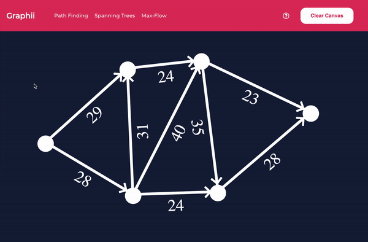

# Graphii

## Create graphs and visualize algorithms!

### Description

This app was created using react and typescript and it allows you to create custom graphs on a finite space zoomable and pannable canvas. You can visualize path algorithms (dfs, bfs, dijkstra, a\*), minimum spanning tree algorithms (prim-jarnik, kruskal), and a max-flow algorithm (ford-fulkerson).

### Functionalities

- Zooming and panning
- Creating and deleting graphs
- Editing edge weights
- Speeding up and slowing down algorithms.
- Pausing and stepping forwards or backwards on algorithms.
- Moving node location.

### Motive

While there are many potential functionalities yet to be added, in the future, I would like for this app to be used in virtual teaching environments, so graph algorithms can be taught without the need of a whiteboard. I also wanted to learn TypeScript.
